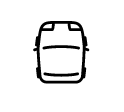
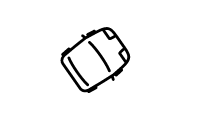
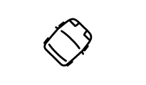

# Animating a car with VueJS

We tend to think that Javascript view libraries (the V in the MVC pattern) are only valid to build big panels, with fancy forms and a lot of interactions, and to make a game we need a library or framework for that purpose.

In this experiment we’ll see how we can use [VueJS](https://vuejs.org/) and a little of SVG to animate a little car around <body>.

## Starting

To start we need [vue-cli](https://chrome.google.com/webstore/detail/vuejs-devtools/nhdogjmejiglipccpnnnanhbledajbpd?hl=es) installed in our computer (npm i -g vue-cli), we’ll use it to develop and compile our code with no effort. It is also recommended to have the develop extension [Vue.js devtools](https://chrome.google.com/webstore/detail/vuejs-devtools/nhdogjmejiglipccpnnnanhbledajbpd?hl=es). To install _vue-cli_:

```
npm i -g vue-cli
```

We create in an empty folder the file where all our component code will be, we can call it Car.vue. More info about [Single File Components](https://vuejs.org/v2/guide/single-file-components.html). The next we’ll need is to [download](https://raw.githubusercontent.com/edus44/animating-car-vue/master/car.svg) our superb SVG car next to _.vue_ file, call it _car.svg_.

## Let's draw

Fill up our _Car.vue_ with [this code](https://github.com/edus44/animating-car-vue/blob/master/step1/Car.vue), then run:

```
vue build -o Car.vue
```

and we should see on the browser:



[See example](https://edus44.github.io/animating-car-vue/step1/dist/index.html), [See code](https://github.com/edus44/animating-car-vue/tree/master/step1)

The _use_ element allow us to insert svg elements from other sources. Thanks to Vue attribute binding, we are passing to this element the path of our car, its width and height, and the x,y coordinates where it will be drawn.

Now we need to give it the option to turn, we can achieve this using computed properties:


[See example](https://edus44.github.io/animating-car-vue/step2/dist/index.html), [See code](https://github.com/edus44/animating-car-vue/tree/master/step2)

We move the position of the car to match the rotation axis with or x,y coordinates.

## Turning animation

Now let’s make it turn at will, to do that we listen to _keydown_ event that will call to a function of our component, which will increment or decrement the angle where our car is looking at.



[See example](https://edus44.github.io/animating-car-vue/step3/dist/index.html), [See code](https://github.com/edus44/animating-car-vue/tree/master/step3)

If we press left or right arrow key, our car will turn to that direction, but in a lineal, clumsy and innacurate way. To improve this we’re going to use an animation technique called tweening, it will provide fluency and easing to our transitions.

We’ll use [this](https://cdnjs.cloudflare.com/ajax/libs/tween.js/16.3.5/Tween.min.js) little, tool, download it as _tween.js_.

##### Tweening

Now we’ll need two methods, one for start and other to stop turning. We’ll listen to _keyup_ events also to know this.

To start turning we define our tween, saying it to increase the turning speed from 0 to 1 (or -1, depending of direction) in 500ms, using an growing easing function To stop we just decrease to 0 the speed using a decreasing easing function.

The _render_ method will be running recursively using [requestAnimationFrame](https://developer.mozilla.org/es/docs/Web/API/Window/requestAnimationFrame), it will be updating the tween value and applying it to the angle of our car.



[See example](https://edus44.github.io/animating-car-vue/step4/dist/index.html), [See code](https://github.com/edus44/animating-car-vue/tree/master/step4)

## Let's move

Now it’s time to **move** the car, we can reuse our function that handles the turning speed to also handle the movement speed.

We just need to revisit our _render_ function, where we need a little **trigonometry** to apply the movement speed taking its angle into account.


[See example](https://edus44.github.io/animating-car-vue/step5/dist/index.html), [See code](https://github.com/edus44/animating-car-vue/tree/master/step5)

And there we go, we have our little car animated in a fluent and agile way. It would only take a few tweaks regarding keybindings, screen boundaries and some resource optimizations ( like you can see here [See example](https://edus44.github.io/animating-car-vue/step6/dist/index.html), [See code](https://github.com/edus44/animating-car-vue/tree/master/step6) ) and you we’ll have your reusable component to build up your game with your favorite view library.

### Bonus

[Here](http://rocket-soccer.surge.sh/) your can see another example where there are more cars involved and a ball, somebody said Rocket League? (To move you can use the arrow keys, WASD and IJKL). [Source code](https://github.com/edus44/rocket-soccer).
